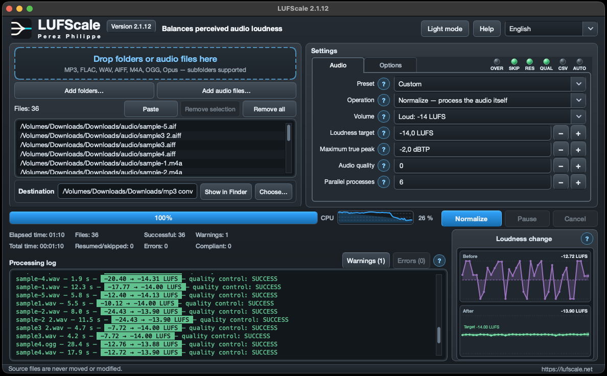

# LUFScale

  <strong>No more volume jumps between your audio files: analyze and normalize them with precision.</strong>

  
  

  macOS 12 or later (Apple Silicon and Intel) &nbsp;•&nbsp; Windows 10 version 1809 or later and Windows 11 (x86-64)
   
  <a href="https://lufscale.net/en">Website</a> &nbsp;•&nbsp;
  <a href="https://youtu.be/6SjLgqinVVg">Video demo</a> &nbsp;•&nbsp;
  <a href="https://github.com/Lufscale/LUFScale/issues">Report a problem</a> &nbsp;•&nbsp;
  <a href="https://github.com/Lufscale/LUFScale/discussions">Ask a question</a>

LUFScale is a free and open-source application for measuring and normalizing the perceived loudness of audio files. It can also analyze files without modifying them or write ReplayGain metadata for compatible players.

Supported formats: MP3, FLAC, WAV, AIF, AIFF, M4A, OGG and Opus.

## Main features

- normalization to a LUFS target with True Peak control;
- analysis without creating an audio output;
- ReplayGain metadata without re-encoding;
- before/after comparison on a fixed scale;
- optional quality control, CSV reports and interrupted-job recovery;
- interface and guides in twelve languages.

## Supported systems

- macOS 12 or later, on Apple Silicon or Intel;
- Windows 10 version 1809 or later and Windows 11, on x86-64 processors.

## Downloads

Ready-to-use applications and their SHA-256 checksums are published under [LUFScale Releases](https://github.com/Lufscale/LUFScale/releases).

The community applications are currently neither notarized with an Apple Developer ID on macOS nor signed with a commercial code-signing certificate on Windows. The operating system may therefore request confirmation when the application is opened for the first time.

## Source code

Version 2.1.12 has two editions that were built and validated separately:

- [`sources/macos`](sources/macos): the application and build tools for macOS;
- [`sources/windows`](sources/windows): the application and build tools for Windows.

The two editions are not merged artificially because the distributed packages were built from source trees that contain differences. Keeping them separate identifies the code and tools associated with each platform precisely.

Detailed instructions are available in each edition's README. Information about third-party source code and compliance is provided in [`SOURCES.md`](SOURCES.md).

## Community and contributions

- Use [Discussions](https://github.com/Lufscale/LUFScale/discussions) for usage questions and general exchanges.
- Report reproducible defects through [Issues](https://github.com/Lufscale/LUFScale/issues).
- See [`CONTRIBUTING.md`](CONTRIBUTING.md) before proposing a change.

## License

The original LUFScale code and documentation are distributed under the [GNU General Public License version 3 or later](LICENSE). Third-party components retain their own licenses; the relevant notices are stored in each edition's directory.

Copyright © 2026 Perez Philippe.
